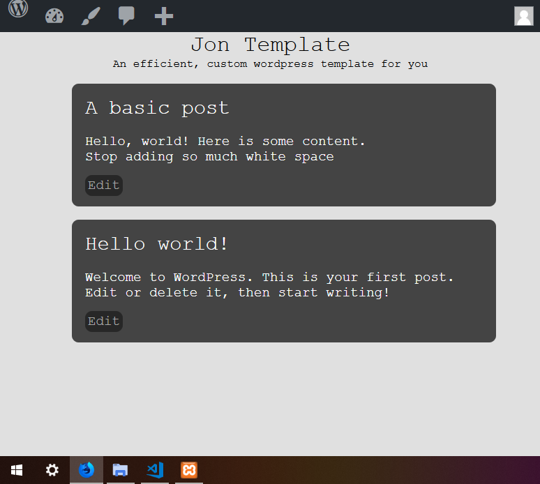

# Jon-Template
My own wordpress template

I'm writting this from scratch 
The idea is to learn the internals by using them, 
learn the parts that get stuck so I can problem solve quicker, 
and write an efficient/sleek theme for later use. 
 
The theme will end up being my go-to for when 
I charge for webmaster-ing, but the theme itself 
is of course open-source =) 

